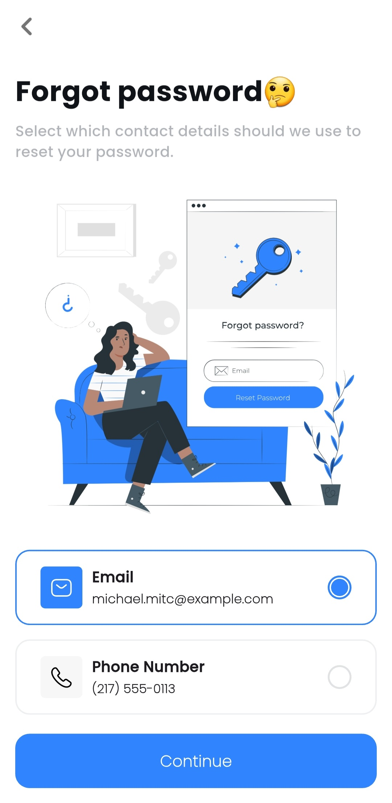
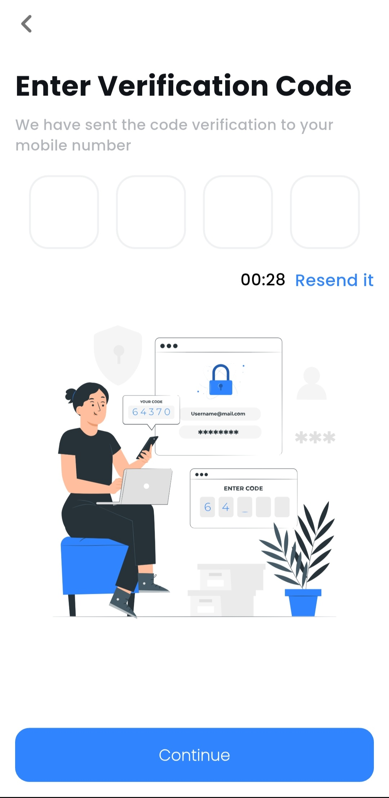
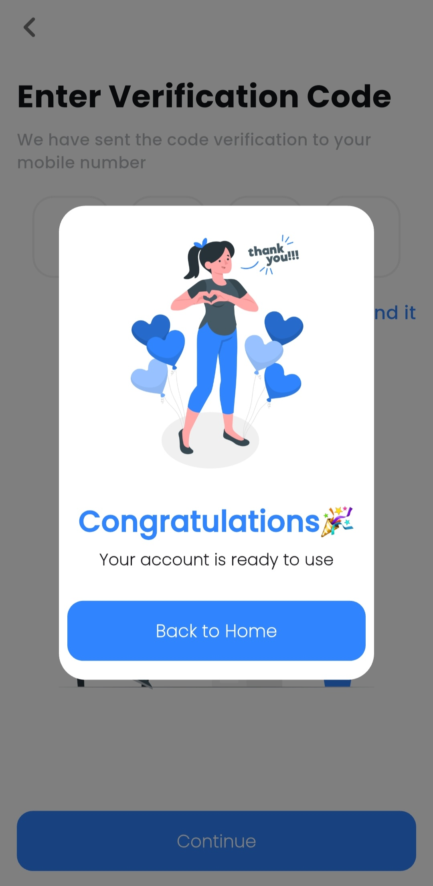
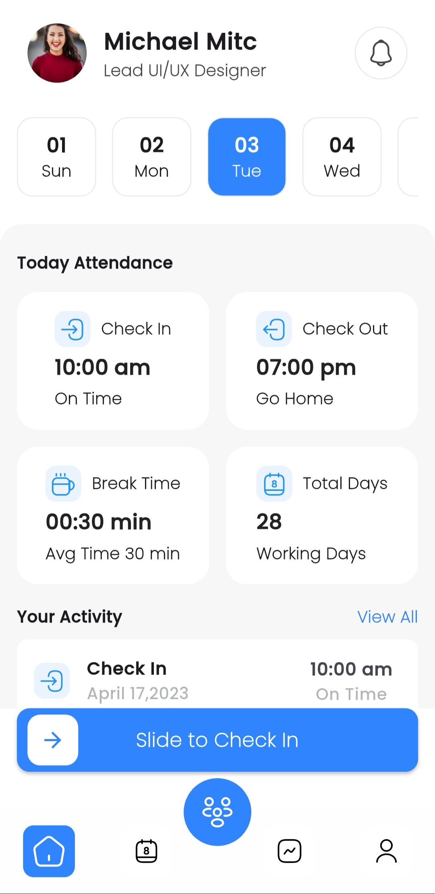
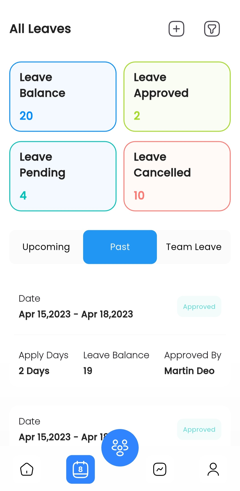
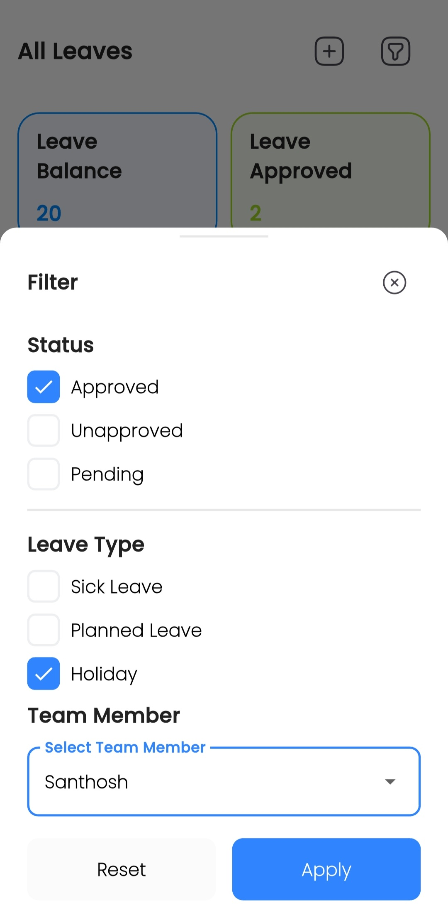
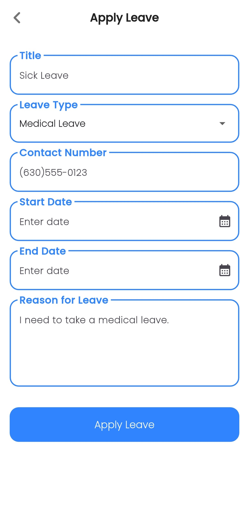
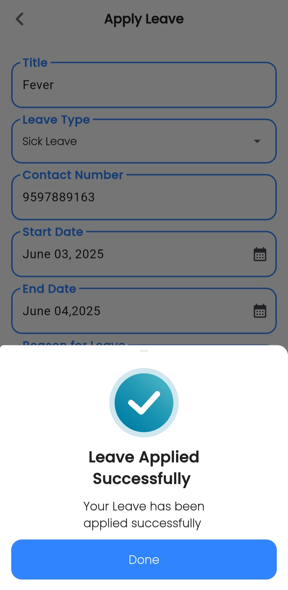
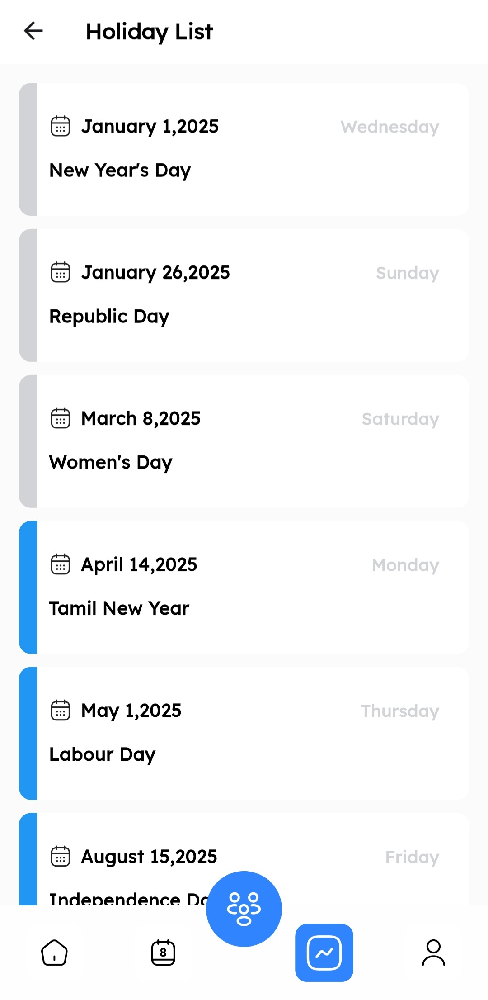
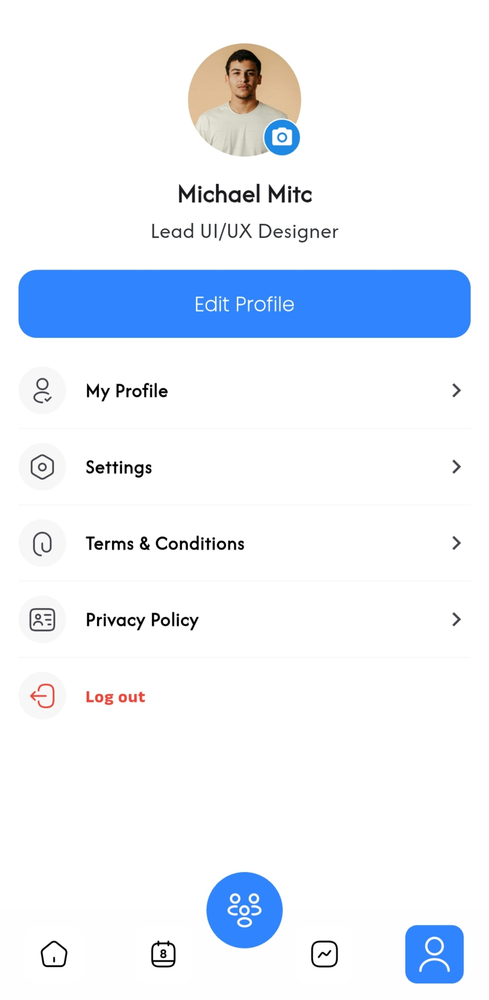

# ⏱️ TimelyTrack – Smart Attendance & Leave Management

TimelyTrack is a modern, Flutter-based attendance and leave management system with **beautiful UI**, **intuitive navigation** , and functionality for both **users** and **admins**. From check-in animations to leave approval workflows, this app streamlines workplace attendance like never before.

---

## ✨ Features

🔐 **Authentication System**  
- Login and Register pages with validation  
- Forgot Password: Recover via email or phone  
- OTP Verification Screen for secure authentication  

🕒 **Slide to Check-In/Check-Out**  
- Sleek **slidable button** to record attendance  
- Real-time check-in and check-out animations  

📆 **Leave Management**  
- Apply for leave using title, leave type, calendar date picker  
- Leave filters by status and leave type:
  - **Status:** Approved, Pending, Unapproved  
  - **Leave Types:** Sick Leave, Planned Leave, Holidays  

👤 **Role-Based Access**  
- **User:**  
  - Apply leave  
  - Check leave status  
  - Track daily attendance  
- **Admin:**  
  - Accept/Reject leave requests  
  - View user leave history  
  - Filter and manage attendance data  

🎨 **Interactive UI**  
- Smooth transitions  
- Animated widgets  
- Clean layout for both mobile and tablet views  

---

## 📸 Screenshots

<div align="center">
  &emsp;
  &emsp;
  &emsp;
  &emsp;
  &emsp;
  &emsp;
  &emsp;
  &emsp;
  &emsp;
  &emsp;
  &emsp;
  &emsp;

  
</div>

---

## 🚀 Getting Started

Follow these instructions to get TimelyTrack running locally.

### 📋 Prerequisites
- Flutter SDK (latest)
- Android Studio / VS Code
- Firebase project (for OTP, Auth)
- Internet connectivity

### ⚙️ Installation

1. **Clone the Repository:**

```bash
git clone https://github.com/yourusername/timelytrack.git
cd timelytrack
```

2. **Install Dependencies:**

```bash
flutter pub get
```

3. **Configure Firebase:**

- Add your google-services.json (Android) or GoogleService-Info.plist (iOS) files

- Set up values.xml for Firebase options

4. **Run the App:**

```bash
flutter run
```
---

## 🛠️ Tech Stack
- Flutter – Cross-platform UI framework

- Dart – Programming language for Flutter

- Firebase – Authentication, OTP, backend support

- Provider – State management

- Flutter Animations – For interactive UI and transitions
---

## 🔐 User & Admin Flow
- User logs in / registers with OTP-based verification

- Slide to Check-In/Out interface for attendance tracking

- Leave application form with type and date selector

- Admin reviews and updates leave statuses

- Filters to navigate leave records efficiently
---

## 🧠 Highlights
- 📱 Fully responsive UI

- 🔒 Secure authentication with OTP

- 📅 Custom calendar and filter widgets

- 🎛️ Separate dashboard experience for admins and users

- 📈 Ideal for remote teams, offices, and institutions


---
## 🙋‍♂️ Author
**Santhosh Kumar P S**

📧 Email: santhoshkumarsakthi2003@gmail.com

💻 GitHub: SanthoshKumar-PS

---
## 💡 Future Enhancements
- 🛒 Cart and in-app payment gateway

- 📦 Real-time order tracking

- 🗣️ User reviews & feedback

- 🎯 Restaurant recommendations using AI

