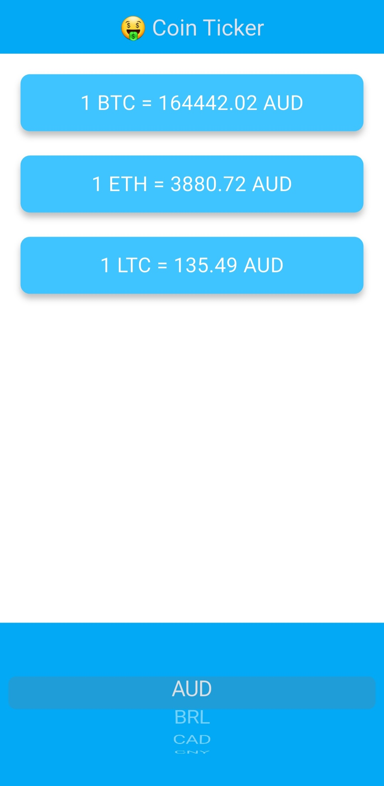
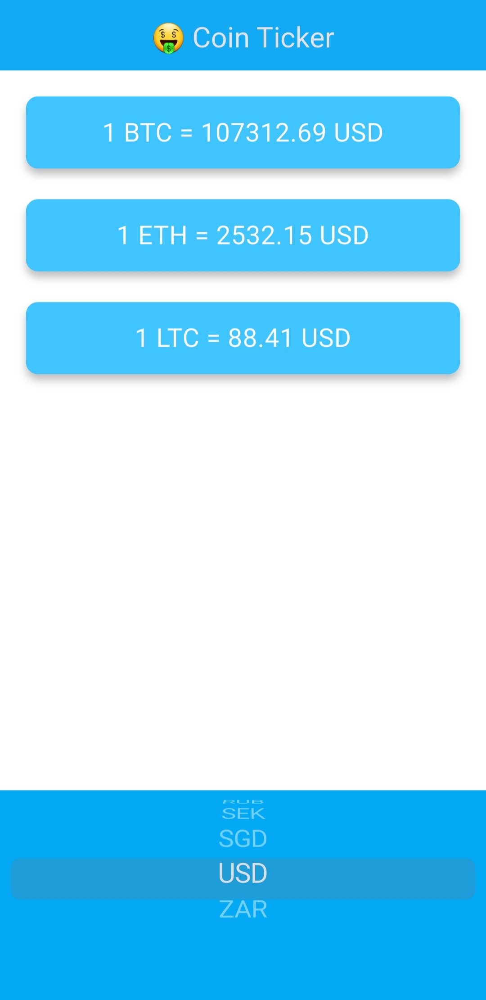
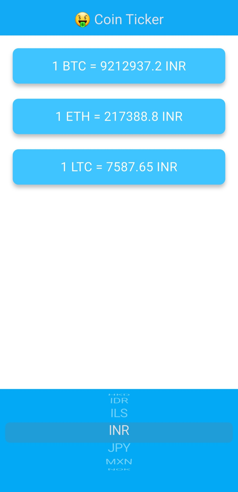

# 💱 Cryptocurrency Converter Application

* A clean, user-friendly mobile application that converts 20+ global currencies to popular cryptocurrencies like **Bitcoin (BTC)**, **Ethereum (ETH)**, and **Litecoin (LTC)**.  
* The app uses real-time exchange rates by integrating a live crypto API and adapts its UI based on the user's platform (Android or iOS) for the best native experience.

---

## ✨ Features

- 🌍 Convert global fiat currencies to cryptocurrencies
- 📈 Real-time conversion using a live API
- 🧭 Platform-specific UI:
  - Android → `DropdownButton`
  - iOS → `CupertinoPicker`
- ⚡ Fast, responsive, and easy to use

---

## 💱 Supported Currencies

The app converts the following fiat currencies to BTC, ETH, and LTC:

`AUD`, `BRL`, `CAD`, `CNY`, `EUR`, `GBP`, `HKD`, `IDR`, `ILS`, `INR`, `JPY`, `MXN`,  
`NOK`, `NZD`, `PLN`, `RON`, `RUB`, `SEK`, `SGD`, `USD`, `ZAR`

---

## 📸 Screenshots

  &emsp;&emsp; 
  &emsp;&emsp;
  

---

## 🚀 Getting Started

1. **Clone the repository:**

git clone https://github.com/SanthoshKumar-PS/cryptocurrency_converter.git
cd cryptocurrency_converter

2. **Install dependencies:**

flutter pub get

3. **Run the app:**

flutter run

---
## 🛠️ Tech Stack
* Flutter – cross-platform UI framework
* Dart – programming language
* CoinAPI / CoinGecko / Open API – for real-time crypto data
* Cupertino / Material widgets – platform-specific UI rendering

## 🔐 Platform Awareness
* ✅ Android → Uses native-looking DropdownButton
* 🍎 iOS → Uses sleek CupertinoPicker

The UI dynamically switches depending on the platform.

---
## 🙋‍♂️ Author
**Santhosh Kumar P S**

📧 Email: santhoshkumarsakthi2003@gmail.com
