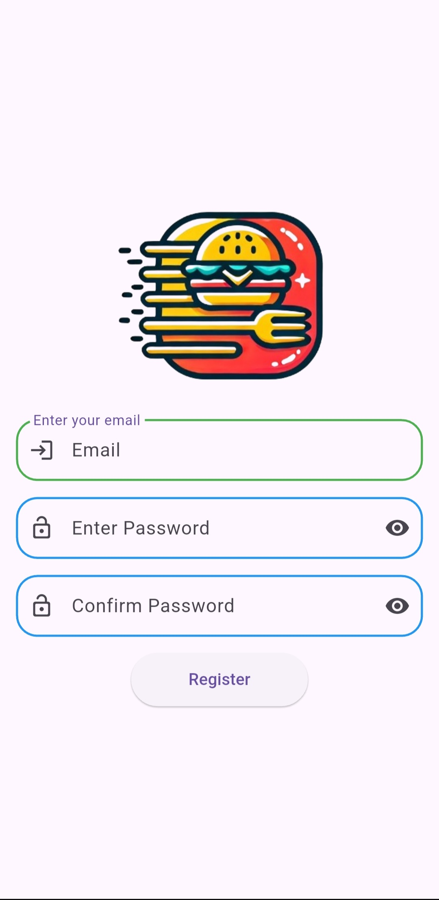
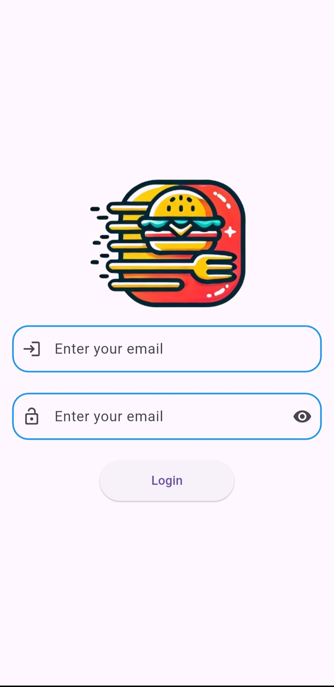
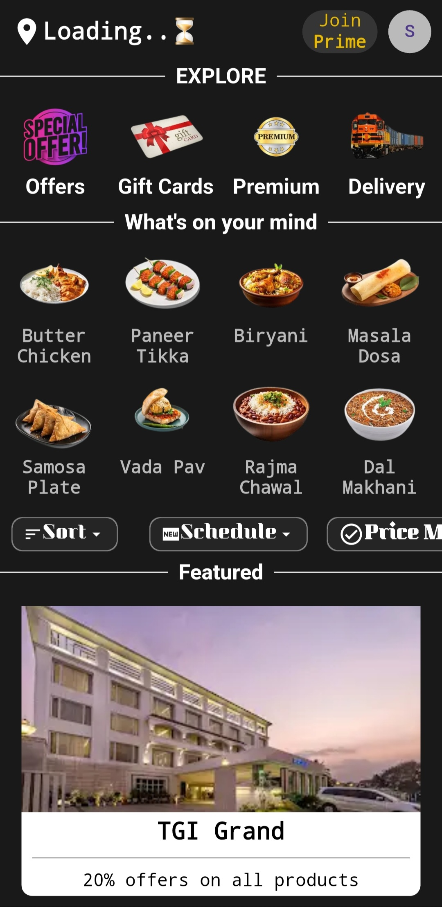
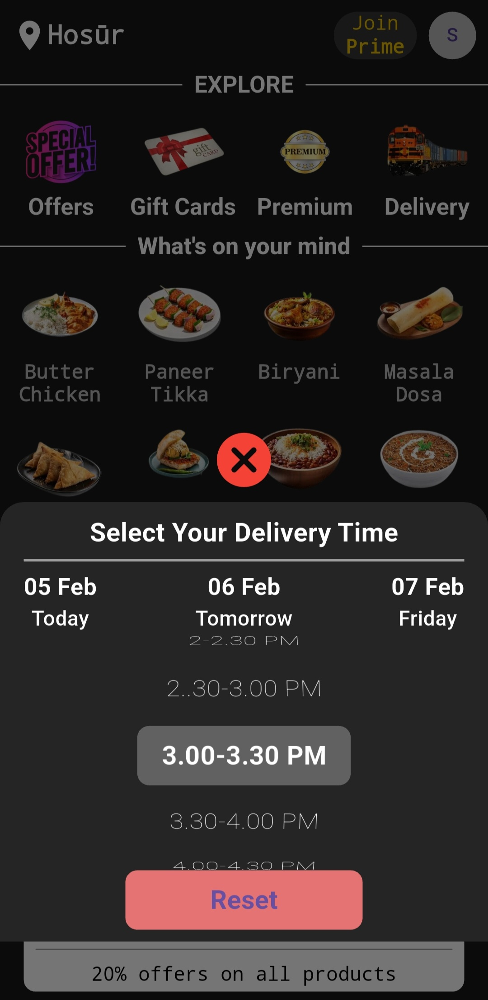
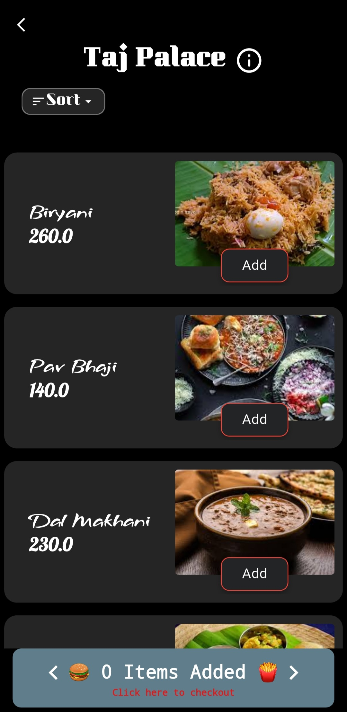
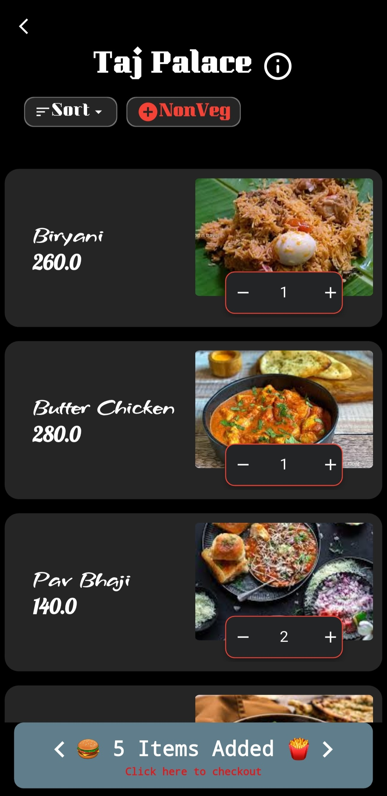
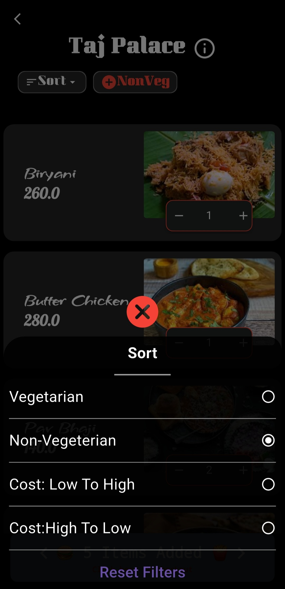
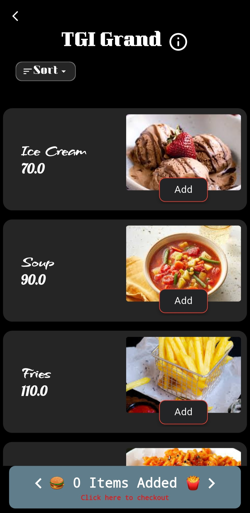

# 🍽️ Feastify – Your Personal Foodie Companion

Feastify is an elegant and powerful Flutter-based food ordering app that redefines your dining experience. Whether you're craving vegetarian or non-vegetarian meals, or looking for budget-friendly options, Feastify helps you **discover restaurants**, **book tables**, and **order food**, all from your mobile device.

---

## ✨ Features

📍 **Smart Geolocation**  
Automatically detects your current location and shows nearby restaurants for a personalized experience.

📅 **Table Booking**  
Book tables at your favorite restaurants based on your comfort and timing.

🍽️ **Restaurant Listings**  
View detailed listings of hotels with menu options, ratings, and user preferences.

🔍 **Powerful Filters**  
Easily filter restaurants and dishes:
- ✅ Veg or 🍗 Non-Veg
- 💸 Price: Low to High / High to Low
- 🏆 Top-rated restaurants

🧭 **Interactive UI**  
Intuitive, modern interface with animations and widgets that make food ordering seamless and fun.

🧾 **Order History & Profile**  
Track your previous orders and manage your personal profile.

---

## 📸 Screenshots

<div align="center">
<!--   &emsp;&emsp; 
  &emsp;&emsp; -->
  &emsp;&emsp;
  &emsp;&emsp;
  &emsp;&emsp;
  &emsp;&emsp;
  &emsp;&emsp;
  &emsp;&emsp;
  &emsp;&emsp;
  &emsp;&emsp;
  &emsp;&emsp;
  &emsp;&emsp;
  &emsp;&emsp;

  
</div>

---

## 🚀 Getting Started

Follow these instructions to set up and run **Feastify** on your local machine.

### Prerequisites

Make sure you have:
- ✅ Flutter SDK
- ✅ Android Studio / VS Code
- ✅ Firebase configured for authentication (if using login features)
- ✅ Internet connection for geolocation and APIs

### Installation Steps

1. **Clone the Repository:**

```bash
git clone https://github.com/yourusername/feastify.git
cd feastify
```
2. **Install Dependencies:**
```bash
flutter pub get
```
3. Run the App:
```bash
flutter run
```
---
## 🛠️ Tech Stack
- Flutter – Cross-platform UI toolkit

- Dart – Programming language for Flutter

- Firebase – (Optional) for authentication and backend support

- Geolocator – To detect real-time user location

- Provider – State management

- Shared Preferences – For lightweight data persistence

---

## 🔐 User Flow & Architecture
1. On launch, the app uses Geolocator to detect location.

2. Restaurants are fetched based on that location.

3. Users can browse, filter options, view menus, and book tables.

4. The state is managed using the Provider package to ensure smooth navigation and responsiveness.
---
## 🙋‍♂️ Author
**Santhosh Kumar P S**

📧 Email: santhoshkumarsakthi2003@gmail.com

💻 GitHub: SanthoshKumar-PS

---
## 💡 Future Enhancements
- 🛒 Cart and in-app payment gateway

- 📦 Real-time order tracking

- 🗣️ User reviews & feedback

- 🎯 Restaurant recommendations using AI

