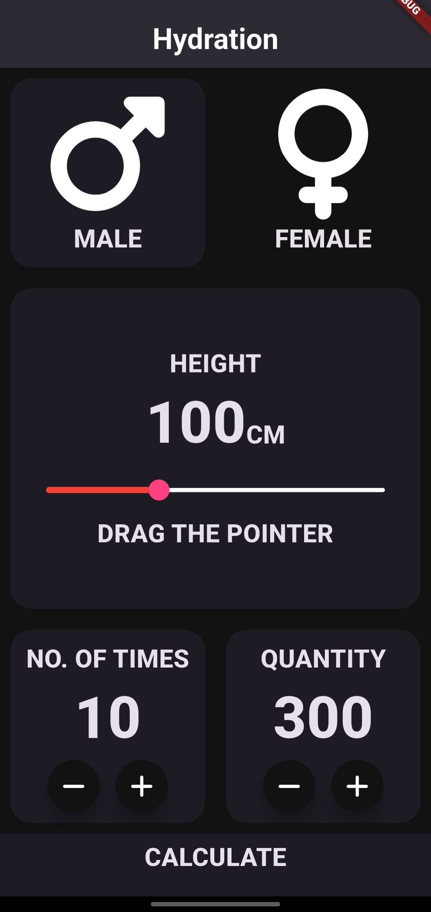
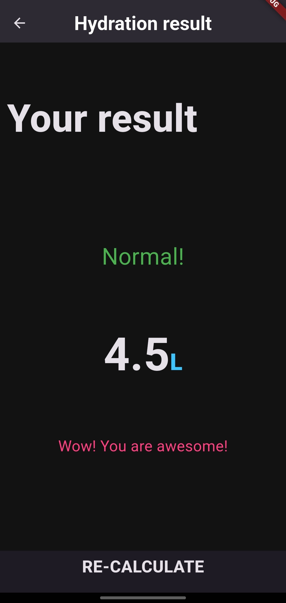

# 💧 Water Monitor Application

* This is a useful and user-friendly mobile application built to track daily water intake.  
* It calculates whether the amount of water consumed is sufficient for the user's body based on the height, number of times water is consumed, and the quantity consumed each time.

---

## ✨ Features

- 📏 Input user's height
- 🥤 Record number of times water is consumed
- 💧 Input quantity of water consumed each time
- 📊 Calculate and display whether the water intake is sufficient

---

## 📸 Screenshots

   
  
  

---

## 🚀 Getting Started

1. **Clone the repository:**
* git clone https://github.com/SanthoshKumar-PS/water_monitor.git
* cd water_monitor
2. **Install dependencies:**
* flutter pub get
3. **Run the app:**
* flutter run

---

## 🛠️ Tech Stack
* Flutter
* Dart
* Android Studio

---

## 🙋‍♂️ Author
**Santhosh Kumar P S**

📧 Email: santhoshkumarsakthi2003@gmail.com

📱 Phone: +91 9597889163

