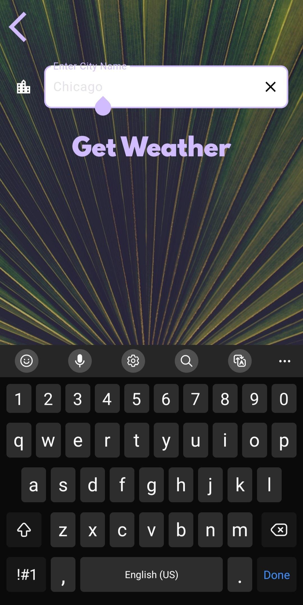

# 🌦️ ClimateApp - Real-Time Weather Tracker

**ClimateApp** is a sleek and responsive Flutter application designed to deliver real-time weather updates based on your current location or a city you search for. It utilizes the **Geolocator** package to get latitude and longitude and fetches weather data using a public **Weather API** (OpenWeatherMap).

---

## ✨ Features

- 📍 Get current location using **Geolocator**
- 🌐 Search and get weather info for **any city worldwide** (e.g., Chennai, San Francisco)
- 🌡️ View temperature, weather condition, and icons
- 🔄 Refresh weather data on demand
- 💻 Clean and responsive UI

---

## 📸 Screenshots

   &emsp;&emsp; 
   &emsp;&emsp; 
  

   &emsp;&emsp; 
   &emsp;&emsp; 
  

---

## 🚀 Getting Started

1. **Clone the repository:**

git clone https://github.com/SanthoshKumar-PS/flutter-projects.git

cd flutter-projects/y_climateapp

2. **Install dependencies:**

flutter pub get

3. **Add your API key:**
Go to your weather API provider (like OpenWeatherMap)

Create an .env file or edit the API key in the service file.

4. **Run the app:**

flutter run

---

## 🔑 Dependencies
* geolocator - for location access

* http - for API calls

* flutter_spinkit (optional) - for loading animations

---

## 🛠️ Tech Stack
Flutter

Dart

Android Studio / VS Code

---

## 🌐 API Provider
You can use APIs like:

* OpenWeatherMap

* WeatherAPI

Be sure to configure and secure your API key.

---

## 🙋‍♂️ Author
**Santhosh Kumar P S**

📧 Email: santhoshkumarsakthi2003@gmail.com

📦 GitHub: SanthoshKumar-PS
